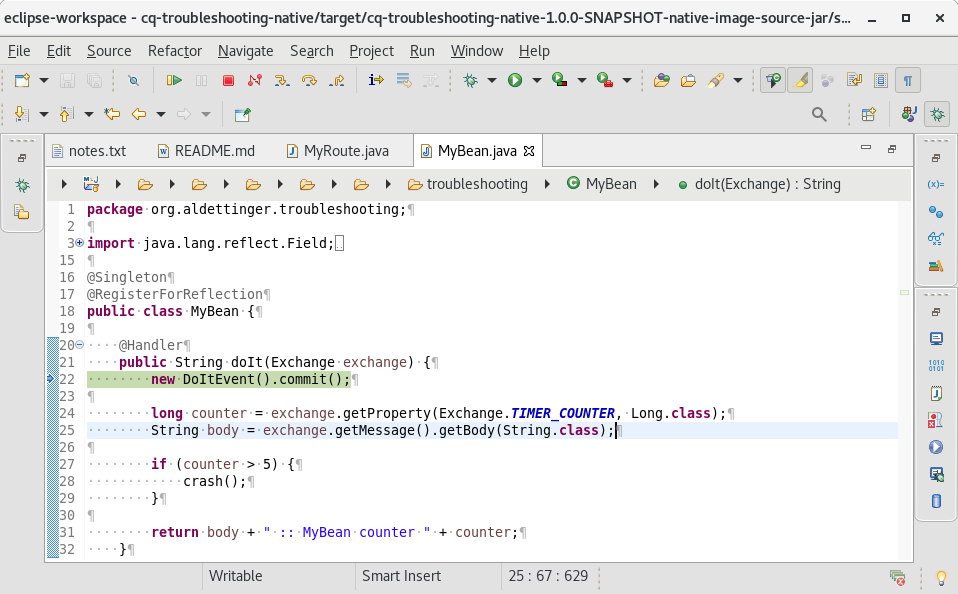
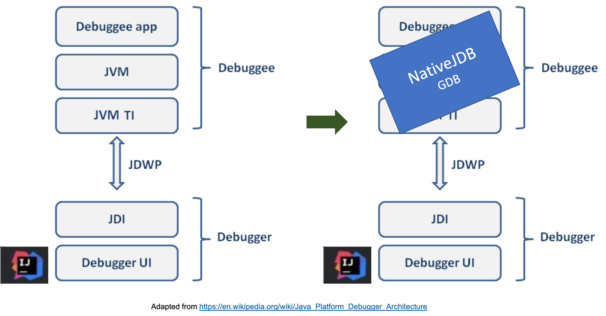
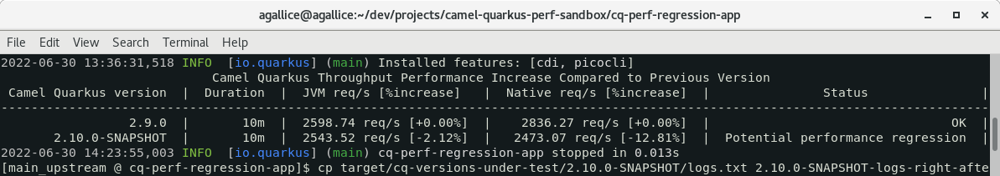
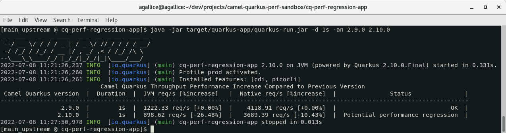

# Camel Quarkus Troubleshooting Stories

Camel Quarkus in few bullets:
 + Making the best of Camel play well with the best of Quarkus
 + Fast jar in JVM mode and native executable in native mode
 + A camel component is wrapped in a Quarkus extensions (deployment + runtime artifacts)
 + The extension deployment artifacts are oriented toward build time logic (@BuildStep, *BuildItems, @Recorder)
 + The extension runtime artifacts are oriented toward runtime logic (native substitutions)

So, it's simple.
We need the best of Camel troubleshooting playing well with the best of Quarkus troubleshooting :bowtie:

## Troubleshooting in JVM mode

Having a look at issues reported in the Camel Quarkus community, we learn good lessons.

First, most of the issues experienced by users in JVM mode finally ends up to be bugs in Camel or to a less extent Quarkus.
So a key point here is to route the issue to the right project.

There is no golden rule, still let's think where an issue is most likely to be corrected in situations below:
 + A Camel Quarkus issue could also be reproduced on Camel Spring Boot (Camel/Camel Quarkus/Quarkus)
 + A Camel Quarkus application working in JVM mode is not working in native mode (Camel Quarkus/Quarkus/Camel)
 + A Camel Quarkus issue could also be reproduced on another Quarkus Platform participant (Quarkus/Camel Quarkus/Camel)

Second, beyond that, we still have a few more tricks presented in this breakfix scenario in the `cq-troubleshooting-jvm` folder:
 + Tweaking camel-quarkus/quarkus versions alignment and changing boms order are not good ideas
 + Missing camel-quarkus dependency (camel-quarkus-bean dependency is not set)
 + Taking the responsibility of creating a camel component instance could interfere with camel-quarkus extension logic
 + Configs are set after object initialization (@Config with static initializer)
 + Using profile could help to have a configuration per environment (dev, test, prod... maybe custom)

```
mvn package
java -jar target/quarkus-app/quarkus-run.jar
# And in another window
curl http://localhost:8080/hello
# We expect to see BasicMessageInProd and not BasicMessage
```

 + Tuning the logging level could be achieved via configuration items (find instructions in application.properties)

```
watch curl http://localhost:8080/hello
# In another window, try below command lines and explain
java -jar target/quarkus-app/quarkus-run.jar
java -jar target/quarkus-app/quarkus-run.jar -Dquarkus.log.category.\"org.apache.camel.impl\".level=DEBUG
java -Dquarkus.log.category.\"org.apache.camel.impl\".level=DEBUG -jar target/quarkus-app/quarkus-run.jar
java -Dquarkus.log.category.\"org.apache.camel.quarkus.core\".level=DEBUG -jar target/quarkus-app/quarkus-run.jar
# We can use -Djavax.net.debug=ssl to have SSL debugging as well (tested with rest-to-nats-demo in JVM and native mode)
```

 + With the use of `micrometer` and `registry-prometheus` extensions, we are able to touch the monitoring subject.
   Let's review some out of the box metrics available at [http://localhost:8080/q/metrics](http://localhost:8080/q/metrics).
   This opens up the vast subject of observability and we have a good [example](https://github.com/apache/camel-quarkus-examples/tree/main/observability) for that.

## Troubleshooting in native mode

In native mode, an executable targeting a specific operating system is built.
There is a first process assembling a command line to invoke the GraalVM `native image` tool.
Then, a second process is actually running the built command line in order to create the executable.

Let's switch to the `cq-troubleshooting-native` folder:

```
cd ~/dev/projects/camel-quarkus-troubleshooting/cq-troubleshooting-native
```

Let's do a build with some interesting options:

```
mvn clean package -Dnative -Dquarkus.native.additional-build-args='--trace-class-initialization=org.aldettinger.troubleshooting.MyRoute,-H:-OmitInlinedMethodDebugLineInfo' -Dquarkus.native.enable-reports -Dquarkus.native.debug.enabled -Dquarkus.native.enable-vm-inspection=true
```

### Pass an option to the native-image tool

Scenario: Quarkus is hiding some of GraalVM complexities to users. Fine but I need to pass some extra parameters to the native-image command line.

Indeed, the `native-image` tool has a lot of [interesting options](https://www.graalvm.org/22.1/reference-manual/native-image/Options/#options-to-native-image-builder) that could be useful to investigate an issue.

Those options could be passed to `native-image` through Quarkus using `-Dquarkus.native.additional-build-args`.

For instance, we can trace the class initialization of the `MyRoute` class with the option:

```
-Dquarkus.native.additional-build-args='--trace-class-initialization=org.aldettinger.troubleshooting.MyRoute'
```

In the console logs, the `native-image` command line has been impacted:

```
native-image ... --trace-class-initialization=org.aldettinger.troubleshooting.MyRoute ...
```

Please notice the log line related to class initialization traces:

```
# Printing 1 class initialization trace(s) of class(es) traced by TraceClassInitialization to: /home/agallice/dev/projects/camel-quarkus-troubleshooting/cq-troubleshooting-native/target/cq-troubleshooting-native-1.0.0-SNAPSHOT-native-image-source-jar/reports/traced_class_initialization_20220701_124538.txt
```

The report contains the stack trace involved in the initialization of the `MyRoute` class.
From this report, would you be able to find clues that the `MyRoute` class initialization:
 + has been recorded at build time ?
 + has been performed through reflection ?

This is just an example, the bottom line being that we can pass options to `native-image` using `-Dquarkus.native.additional-build-args`.

### Checking what Java code has been embedded inside the native executable

Scenario: I have simplified my application not to use select classes/methods. How could I check that they are no more embedded in the native executable ?

In native mode, we are able to print some native reports, we have done this in the command line by passing:

```
-Dquarkus.native.enable-reports
```

In the `native-image` logs, let's focus on those `.txt` report files:

```
# Printing list of used methods to: /home/agallice/dev/projects/camel-quarkus-troubleshooting/cq-troubleshooting-native/target/cq-troubleshooting-native-1.0.0-SNAPSHOT-native-image-source-jar/reports/used_methods_cq-troubleshooting-native-1.0.0-SNAPSHOT-runner_20220701_151920.txt
# Printing list of used classes to: /home/agallice/dev/projects/camel-quarkus-troubleshooting/cq-troubleshooting-native/target/cq-troubleshooting-native-1.0.0-SNAPSHOT-native-image-source-jar/reports/used_classes_cq-troubleshooting-native-1.0.0-SNAPSHOT-runner_20220701_151921.txt
# Printing list of used packages to: /home/agallice/dev/projects/camel-quarkus-troubleshooting/cq-troubleshooting-native/target/cq-troubleshooting-native-1.0.0-SNAPSHOT-native-image-source-jar/reports/used_packages_cq-troubleshooting-native-1.0.0-SNAPSHOT-runner_20220701_151921.txt
```

And let's see that `UnusedClass` is not embedded whereas `MyRoute.unusedMethodIncludedInTheGraph` is embedded:

```
grep 'unusedMethodIncludedInTheGraph' target/cq-troubleshooting-native-1.0.0-SNAPSHOT-native-image-source-jar/reports/used_methods_cq-troubleshooting-native-1.0.0-SNAPSHOT-runner_*.txt
```

It output lines like below:

```
org.aldettinger.troubleshooting.MyRoute.unusedMethodIncludedInTheGraph():void
org.aldettinger.troubleshooting.MyRoute_ClientProxy.unusedMethodIncludedInTheGraph():void
```

So, it's not used but embedded. Can you explain why ?
Let's remember that the `MyRoute` class is [registered for reflection](https://github.com/apache/camel-quarkus/blob/main/extensions-core/core/deployment/src/main/java/org/apache/camel/quarkus/core/deployment/CamelNativeImageProcessor.java#L279) with methods. By default, Quarkus embed all methods.

Now, let's check whether `UnusedClass` is embedded or not with command below:

```
grep Unused target/cq-troubleshooting-native-1.0.0-SNAPSHOT-native-image-source-jar/reports/used_classes_cq-troubleshooting-native-1.0.0-SNAPSHOT-runner_*.txt 
```

We see there that `UnusedClass` has not been embedded.

### Extracting information from a native executable

Scenario: I have some native executables deployed out there. How could I check:
 + the version of the JVM embedded in the native executable ?
 + the GraalVM version used to build the native executable ?
 + whether I'm using Mandrel or GraalVM ?

Standard tools could be used to inspect the native executable.
For instance `readelf`, `strings` and so on.

Executing the command below:

```
strings target/cq-troubleshooting-native-1.0.0-SNAPSHOT-runner | grep core.VM
```

Would output some interesting bits:

```
com.oracle.svm.core.VM=GraalVM 22.0.0.2 Java 11 CE
com.oracle.svm.core.VM.Java.Version=11.0.14
com.oracle.svm.core.VM.Target.Platform=org.graalvm.nativeimage.Platform$LINUX_AMD64

[27x_downstream @ nats]$ strings target/camel-quarkus-integration-test-nats-2.7.1.fuse-SNAPSHOT-runner | grep core.VM
com.oracle.svm.core.VM=GraalVM 21.3.2.0-Final Java 11 Mandrel Distribution
com.oracle.svm.core.VM.Java.Version=11.0.15
com.oracle.svm.core.VM.Target.Platform=org.graalvm.nativeimage.Platform$LINUX_AMD64
```

### Passing flags to the native executable

Scenario: I need to print garbage collection information. How could I do that in native mode ?

It's possible to pass flags to the native executable, the whole list can be obtained using `-XX:PrintFlags=`:

```
target/cq-troubleshooting-native-1.0.0-SNAPSHOT-runner -XX:PrintFlags=
```

It outputs some accessible flags below:

```
  -XX:ActiveProcessorCount=-1                  Overwrites the available number of processors provided by the OS. Any value <= 0 means using the processor count from
                                               the OS.
  -XX:±AutomaticReferenceHandling              Determines if the reference handling is executed automatically or manually. Default: + (enabled).
...
...
...
  -XX:±UsePerfData                             Flag to disable jvmstat instrumentation for performance testing. Default: + (enabled).
  -XX:±VerboseGC                               Print more information about the heap before and after each collection. Default: - (disabled).
```

For instance, let's reduce the threads stack size to 1 byte:

```
target/cq-troubleshooting-native-1.0.0-SNAPSHOT-runner -XX:StackSize=1
```

Of course, we quickly reach a `StackOverflowError`:

```
java.lang.StackOverflowError: null
    at com.oracle.svm.core.graal.snippets.StackOverflowCheckImpl.newStackOverflowError0(StackOverflowCheckImpl.java:333)
    at com.oracle.svm.core.graal.snippets.StackOverflowCheckImpl.newStackOverflowError(StackOverflowCheckImpl.java:329)
    at com.oracle.svm.core.graal.snippets.StackOverflowCheckImpl.throwNewStackOverflowError(StackOverflowCheckImpl.java:309)
    at java.io.PrintStream.writeln(PrintStream.java:718)
    at java.io.PrintStream.println(PrintStream.java:1028)
    at com.oracle.svm.core.graal.snippets.CEntryPointSnippets.initializeIsolate(CEntryPointSnippets.java:346)
    at com.oracle.svm.core.JavaMainWrapper$EnterCreateIsolateWithCArgumentsPrologue.enter(JavaMainWrapper.java:383)
```

This is just an example, the bottom line being that it's possible to pass some flags to the native executable.

And actually, there is a more concrete case where passing flags to the native executable has helped.
In camel-quarkus 2.10.0, I was suspecting a 10% mean throughput drop in native mode compared to camel-quarkus-2.9.0.
I was able to pass some flags to the native executable to get more logs about garbage collection:

```
-XX:+PrintGC -XX:+VerboseGC
```

And then compare the garbage collection logs between both versions.
With camel-quarkus 2.9.0, the last log looks like:

```
[[47201169170742 GC: before  epoch: 778  cause: CollectOnAllocation]
[Incremental GC (CollectOnAllocation) 286720K->24576K, 0.0008521 secs]
 [47201170042867 GC: after   epoch: 778  cause: CollectOnAllocation  policy: by space and time  type: incremental
  collection time: 852161 nanoSeconds]]
```

While with camel-quarkus 2.10.0, the last log is the following:

```
[[48590247521300 GC: before  epoch: 1033  cause: CollectOnAllocation]
[Incremental GC (CollectOnAllocation) 295936K->33792K, 0.0012861 secs]
 [48590248820674 GC: after   epoch: 1033  cause: CollectOnAllocation  policy: by space and time  type: incremental
  collection time: 1286184 nanoSeconds]]
```

So, the garbage collector is called more frequently, collection take longer time while the unreclaimed memory is higher.
That could explain a performance drop.

### Collecting JFR events

Scenario: I need to collect some custom monitoring events in order to diagnose my application. How could I do this in native mode ?

JFR events could be collected since GraalVM CE 21.2.0.
The native image built at the beginning of this section included a parameter for that:

```
-Dquarkus.native.enable-vm-inspection=true
```

Now, at runtime, we could configure the native executable to record JFR events as below:

```
target/cq-troubleshooting-native-1.0.0-SNAPSHOT-runner -XX:+FlightRecorder -XX:StartFlightRecording="filename=recording.jfr" -Dcrash=false
```

An output similar to below will be produced:

```
__  ____  __  _____   ___  __ ____  ______ 
 --/ __ \/ / / / _ | / _ \/ //_/ / / / __/ 
 -/ /_/ / /_/ / __ |/ , _/ ,< / /_/ /\ \   
--\___\_\____/_/ |_/_/|_/_/|_|\____/___/   
2023-01-17 13:06:08,268 INFO  [org.apa.cam.qua.cor.CamelBootstrapRecorder] (main) Bootstrap runtime: org.apache.camel.quarkus.main.CamelMainRuntime
2023-01-17 13:06:08,268 INFO  [org.apa.cam.mai.MainSupport] (main) Apache Camel (Main) 3.19.0 is starting
2023-01-17 13:06:08,270 INFO  [org.apa.cam.imp.eng.AbstractCamelContext] (main) Apache Camel 3.19.0 (camel-1) is starting
2023-01-17 13:06:08,271 INFO  [org.apa.cam.imp.eng.AbstractCamelContext] (main) Routes startup (started:1)
2023-01-17 13:06:08,271 INFO  [org.apa.cam.imp.eng.AbstractCamelContext] (main)     Started route1 (timer://test)
2023-01-17 13:06:08,271 INFO  [org.apa.cam.imp.eng.AbstractCamelContext] (main) Apache Camel 3.19.0 (camel-1) started in 0ms (build:0ms init:0ms start:0ms)
2023-01-17 13:06:08,271 INFO  [io.quarkus] (main) cq-troubleshooting-native 1.0.0-SNAPSHOT native (powered by Quarkus 2.15.3.Final) started in 0.007s. 
2023-01-17 13:06:08,271 INFO  [io.quarkus] (main) Profile prod activated. 
2023-01-17 13:06:08,271 INFO  [io.quarkus] (main) Installed features: [camel-bean, camel-core, camel-log, camel-timer, cdi]
2023-01-17 13:06:09,271 INFO  [route1] (Camel (camel-1) thread #1 - timer://test) null :: MyBean counter 1
2023-01-17 13:06:10,272 INFO  [route1] (Camel (camel-1) thread #1 - timer://test) null :: MyBean counter 2
2023-01-17 13:06:11,272 INFO  [route1] (Camel (camel-1) thread #1 - timer://test) null :: MyBean counter 3
^C2023-01-17 13:06:11,392 INFO  [org.apa.cam.imp.eng.AbstractCamelContext] (Shutdown thread) Apache Camel 3.19.0 (camel-1) is shutting down (timeout:45s)
2023-01-17 13:06:11,394 INFO  [org.apa.cam.imp.eng.AbstractCamelContext] (Shutdown thread) Routes stopped (stopped:1)
2023-01-17 13:06:11,394 INFO  [org.apa.cam.imp.eng.AbstractCamelContext] (Shutdown thread)     Stopped route1 (timer://test)
2023-01-17 13:06:11,394 INFO  [org.apa.cam.imp.eng.AbstractCamelContext] (Shutdown thread) Apache Camel 3.19.0 (camel-1) shutdown in 1ms (uptime:3s)
2023-01-17 13:06:11,395 INFO  [io.quarkus] (Shutdown thread) cq-troubleshooting-native stopped in 0.003s
```

Finally, let's kill the native application and we see that a file named `recording.jfr` has been created.
We could now print the interesting events as below:

```
jfr print --events 'org.aldettinger.troubleshooting.MyBean$DoItEvent' recording.jfr
```

The command produces below output:

```
org.aldettinger.troubleshooting.MyBean$DoItEvent {
  startTime = 15:10:52.646
  message = N/A
  eventThread = "Camel (camel-1) thread #1 - timer://test" (javaThreadId = 47)
}

org.aldettinger.troubleshooting.MyBean$DoItEvent {
  startTime = 15:10:53.646
  message = N/A
  eventThread = "Camel (camel-1) thread #1 - timer://test" (javaThreadId = 47)
}
```

### Collecting Heap/Stack dumps

Scenario: Is there a memory leak ? Is there a thread hanging ?

Heap and stack dumps could provide great information about what's going on in a JVM.
The good news is that it's possible to catch them with GraalVM CE version 22.2.0.

The flag needed is the same as for collecting JFR events.
The native image built at the beginning of this section included a parameter for that:

```
-Dquarkus.native.enable-vm-inspection=true
```

From there, we can have a terminal running the executable:

```
target/cq-troubleshooting-native-1.0.0-SNAPSHOT-runner -Dmem-leak=true -Dcrash=false
```

And another terminal triggering the heap dump:

```
kill -SIGUSR1 `pidof cq-troubleshooting-native-1.0.0-SNAPSHOT-runner`
```

The `hprof` file is generated in the current directory:

```
[main_upstream @ cq-troubleshooting-native]$ ls *.hprof
svm-heapdump-5206-20221014T161127Z.hprof
```

And we can open it with a tool like eclipse mat or similar.

We could as well generate a stack dump with:

```
kill -3 `pidof cq-troubleshooting-native-1.0.0-SNAPSHOT-runner`
```

And find the thread dump, but this time in the console output:

```
022-10-14T16:27:45.974873Z
Thread dump follows:

"Reference Handler" #40 daemon prio=10   java.lang.thread.State: WAITING
	at com.oracle.svm.core.genscavenge.HeapImpl.transitionToNativeThenAwaitPendingRefs(HeapImpl.java:577)
...
	at com.oracle.svm.core.posix.thread.PosixPlatformThreads.pthreadStartRoutine(PosixPlatformThreads.java:202)

"main" #1 prio=5   java.lang.thread.State: WAITING
	at com.oracle.svm.core.posix.headers.Pthread.pthread_cond_wait(Pthread.java)
...
	at io.quarkus.runner.GeneratedMain.main(unknown source)
```

Note that there is an upstream [ticket](https://github.com/oracle/graal/issues/5223) to separate the thread dump from stdout.

There are more subjects like `-XX:+DumpHeapAndExit` or the fact that heap dump can't be created on Windows.
More information are available [here](https://www.graalvm.org/22.2/reference-manual/native-image/guides/create-heap-dump/).

### Debugging a native executable

Sometimes, we face situation where we need to debug.
The most important fact to remember is that in most situation we can debug in JVM mode as well.
In the rare situations where the application behaves differently in native mode, then it's time to review debugging options.

#### Debugging a native executable with GDB

With a native executable, it's possible to use a debugger like [gdb](https://www.geeksforgeeks.org/gdb-command-in-linux-with-examples/).
In the command line, we have included some debug information thanks to options below:

```
-Dquarkus.native.debug.enabled
-Dquarkus.native.additional-build-args=-H:-OmitInlinedMethodDebugLineInfo
```

Then we can invoke `gdb` like below:

```
gdb target/cq-troubleshooting-native-1.0.0-SNAPSHOT-runner
```

And then, let's start the application by typing:

```
run
```

Then, gdb will catch the segmentation fault:

```
Program received signal SIGSEGV, Segmentation fault.
[Switching to Thread 0x7fffedbff700 (LWP 7575)]
com.oracle.svm.core.UnmanagedMemoryUtil.copyLongsBackward(union org.graalvm.word.Pointer, union org.graalvm.word.Pointer, union org.graalvm.word.UnsignedWord)void ()
    at com/oracle/svm/core/UnmanagedMemoryUtil.java:169
169	            long l24 = src.readLong(24);
Missing separate debuginfos, use: debuginfo-install glibc-2.17-326.el7_9.x86_64 libgcc-4.8.5-44.el7.x86_64 sssd-client-1.16.5-10.el7_9.12.x86_64 zlib-1.2.7-20.el7_9.x86_64
```

And, we can print the stack trace with the `bt` command:

```
(gdb) bt
#0  com.oracle.svm.core.UnmanagedMemoryUtil.copyLongsBackward(union org.graalvm.word.Pointer, union org.graalvm.word.Pointer, union org.graalvm.word.UnsignedWord)void ()
    at com/oracle/svm/core/UnmanagedMemoryUtil.java:169
#1  0x0000000000416174 in com.oracle.svm.core.UnmanagedMemoryUtil.copyBackward(union org.graalvm.word.Pointer, union org.graalvm.word.Pointer, union org.graalvm.word.UnsignedWord)void ()
    at com/oracle/svm/core/UnmanagedMemoryUtil.java:110
#2  0x0000000000416128 in com.oracle.svm.core.UnmanagedMemoryUtil.copy(union org.graalvm.word.Pointer, union org.graalvm.word.Pointer, union org.graalvm.word.UnsignedWord)void ()
    at com/oracle/svm/core/UnmanagedMemoryUtil.java:67
#3  0x00000000004112c0 in com.oracle.svm.core.JavaMemoryUtil.unsafeCopyMemory(java.lang.Object, long, java.lang.Object, long, long)void () at com/oracle/svm/core/JavaMemoryUtil.java:276
#4  0x0000000000c95efe in jdk.internal.misc.Unsafe.copyMemory(java.lang.Object, long, java.lang.Object, long, long)void () at jdk/internal/misc/Unsafe.java:784
#5  0x0000000000d206af in org.aldettinger.troubleshooting.MyBean.crash()void () at org/aldettinger/troubleshooting/MyBean.java:35
#6  0x0000000000d2099f in org.aldettinger.troubleshooting.MyBean.doIt(org.apache.camel.Exchange)java.lang.String () at org/aldettinger/troubleshooting/MyBean.java:23
#7  0x000000000055aaef in com.oracle.svm.core.reflect.ReflectionAccessorHolder.MyBean_doIt_6ecb99b7150ef769738c4cd2ca873f7deeb93faf(boolean, java.lang.Object, java.lang.Object[])java.lang.Object ()
    at com/oracle/svm/core/reflect/ReflectionAccessorHolder.java:1
#8  0x00000000005bdab2 in com.oracle.svm.core.reflect.SubstrateMethodAccessor.invoke(java.lang.Object, java.lang.Object[])java.lang.Object () at com/oracle/svm/core/reflect/SubstrateMethodAccessor.java:60
#9  0x000000000117d853 in org.apache.camel.support.ObjectHelper.invokeMethodSafe(java.lang.reflect.Method, java.lang.Object, java.lang.Object[])java.lang.Object ()
    at org/apache/camel/support/ObjectHelper.java:380
#10 0x0000000000d5aa5b in org.apache.camel.component.bean.MethodInfo.invoke(java.lang.reflect.Method, java.lang.Object, java.lang.Object[], org.apache.camel.Exchange)java.lang.Object ()
    at org/apache/camel/component/bean/MethodInfo.java:494
#11 0x0000000000d54e33 in org.apache.camel.component.bean.MethodInfo$1.doProceed(org.apache.camel.AsyncCallback)boolean () at org/apache/camel/component/bean/MethodInfo.java:316
#12 0x0000000000d556fd in org.apache.camel.component.bean.MethodInfo$1.proceed(org.apache.camel.AsyncCallback)boolean () at org/apache/camel/component/bean/MethodInfo.java:286
#13 0x0000000000d39170 in org.apache.camel.component.bean.AbstractBeanProcessor.process(org.apache.camel.Exchange, org.apache.camel.AsyncCallback)boolean ()
    at org/apache/camel/component/bean/AbstractBeanProcessor.java:146
#14 0x0000000000d50ea4 in org.apache.camel.component.bean.BeanProcessor.process(org.apache.camel.Exchange, org.apache.camel.AsyncCallback)boolean () at org/apache/camel/component/bean/BeanProcessor.java:81
#15 0x00000000010e5174 in org.apache.camel.processor.errorhandler.RedeliveryErrorHandler$SimpleTask.run()void () at org/apache/camel/processor/errorhandler/RedeliveryErrorHandler.java:471
#16 0x0000000000e89b28 in org.apache.camel.impl.engine.DefaultReactiveExecutor$Worker.schedule(java.lang.Runnable, boolean, boolean, boolean)void ()
    at org/apache/camel/impl/engine/DefaultReactiveExecutor.java:189
#17 0x0000000000e8ae27 in org.apache.camel.impl.engine.DefaultReactiveExecutor.scheduleMain(java.lang.Runnable)void () at org/apache/camel/impl/engine/DefaultReactiveExecutor.java:61
#18 0x00000000010981bd in org.apache.camel.processor.Pipeline.process(org.apache.camel.Exchange, org.apache.camel.AsyncCallback)boolean () at org/apache/camel/processor/Pipeline.java:184
#19 0x0000000000e5f9f2 in org.apache.camel.impl.engine.CamelInternalProcessor.process(org.apache.camel.Exchange, org.apache.camel.AsyncCallback)boolean ()
    at org/apache/camel/impl/engine/CamelInternalProcessor.java:399
#20 0x0000000000d8c44a in org.apache.camel.component.timer.TimerConsumer.sendTimerExchange(long)void () at org/apache/camel/component/timer/TimerConsumer.java:210
#21 0x0000000000d8aea9 in org.apache.camel.component.timer.TimerConsumer$1.run()void () at org/apache/camel/component/timer/TimerConsumer.java:76
#22 0x0000000000b011dc in java.util.TimerThread.mainLoop()void () at java/util/Timer.java:556
#23 0x0000000000b0157b in java.util.TimerThread.run()void () at java/util/Timer.java:506
#24 0x00000000005cb51c in com.oracle.svm.core.thread.PlatformThreads.threadStartRoutine(org.graalvm.nativeimage.ObjectHandle)void () at com/oracle/svm/core/thread/PlatformThreads.java:704
#25 0x00000000004c3541 in com.oracle.svm.core.posix.thread.PosixPlatformThreads.pthreadStartRoutine(com.oracle.svm.core.thread.PlatformThreads$ThreadStartData)org.graalvm.word.WordBase ()
    at com/oracle/svm/core/posix/thread/PosixPlatformThreads.java:202
#26 0x0000000000462ef9 in com.oracle.svm.core.code.IsolateEnterStub.PosixPlatformThreads_pthreadStartRoutine_38d96cbc1a188a6051c29be1299afe681d67942e(com.oracle.svm.core.thread.PlatformThreads$ThreadStartData)org.graalvm.word.WordBase () at com/oracle/svm/core/code/IsolateEnterStub.java:1
#27 0x00007ffff7bc6ea5 in start_thread () from /lib64/libpthread.so.0
#28 0x00007ffff70b7b0d in clone () from /lib64/libc.so.6
```

The method `MyBean.crash()` seems to be responsible.

Let's locate how we could put a breakpoint:

```
info function .*crash.*

```

Below, we put a breakpoint in the `crash()` method and step over the code line by line using `info`, `break` and `next` commands:

```
break org.aldettinger.troubleshooting.MyBean::crash
```

Running the program again from the beginning would lead to the breakpoint being hit, and then could execute code step by step:

```
(gdb) run
The program being debugged has been started already.
Start it from the beginning? (y or n) y
Starting program: /home/agallice/dev/projects/camel-quarkus-troubleshooting/cq-troubleshooting-native/target/cq-troubleshooting-native-1.0.0-SNAPSHOT-runner 
[Thread debugging using libthread_db enabled]
Using host libthread_db library "/lib64/libthread_db.so.1".
[New Thread 0x7ffff4fff700 (LWP 12070)]
[New Thread 0x7fffeffff700 (LWP 12071)]
[New Thread 0x7fffee9ff700 (LWP 12073)]
...
...
...
Breakpoint 1 at 0xd203e0: file org/aldettinger/troubleshooting/MyBean.java, line 30.

Breakpoint 1, org.aldettinger.troubleshooting.MyBean.crash()void () at org/aldettinger/troubleshooting/MyBean.java:30
30	        Field theUnsafe = null;
Missing separate debuginfos, use: debuginfo-install glibc-2.17-326.el7_9.x86_64 libgcc-4.8.5-44.el7.x86_64 sssd-client-1.16.5-10.el7_9.12.x86_64 zlib-1.2.7-20.el7_9.x86_64
(gdb) next
34	            Unsafe unsafe = (Unsafe)theUnsafe.get(null);
(gdb) next
32	            theUnsafe = Unsafe.class.getDeclaredField("theUnsafe");
(gdb) next
34	            Unsafe unsafe = (Unsafe)theUnsafe.get(null);
(gdb) next
35	            unsafe.copyMemory(0, 128, 256);
(gdb) next

Program received signal SIGSEGV, Segmentation fault.
com.oracle.svm.core.UnmanagedMemoryUtil.copyLongsBackward(org.graalvm.word.Pointer, org.graalvm.word.Pointer, org.graalvm.word.UnsignedWord)void () at com/oracle/svm/core/UnmanagedMemoryUtil.java:169
169	            long l24 = src.readLong(24);
```

It's working. Still most Java developers would be used to graphical debuggers.

#### Debugging a native executable with GDB from Eclipse

It seems we have all the DEBUG symbols needed to run `gdb`.
So we might be able to run it from eclipse too, let's try to create a C/C++ debug configuration:
 + Debugs As | Debug Configurations... | C/C++ Application | New Configuration
 + In C++ Application, set the full path to `cq-troubleshooting-native-1.0.0-SNAPSHOT-runner`
 + In the Debugger Tab, set stop on startup to `org.aldettinger.troubleshooting.MyBean.doIt`

`gdb` is started and eclipse display the code where the breakpoint is hit:



We can use some standard debugger command, Step Over, Resume...
Eclipse seems to approximately be able to match the control flow of the application.
However, other features like Breakpoint, Expression Evaluation and so on seems not to be working.

To go further, we would need a kind of GDB debugger that can communicate over the Java Debug Wire Protocol.

#### Debugging with NativeJDB

This is the path explored by [NativeJDB](https://quarkus.io/blog/nativejdb-debugger-for-native-images/).

The architecture is highlighted in the image below coming from [a Quarkus blog post](https://quarkus.io/blog/nativejdb-debugger-for-native-images/):



The idea would be to use the NativeJDB Makefile in order to build a docker image that bundle the JDWP server and the native image under test.
I experimented with instructions below:

```
cd /home/agallice/dev/projects/native-jdb-upstream
sdk use java 11.0.17-tem
make compile
make nativejdb CLASSNAME={nameofjarfile} NATIVEEXEC=apps/{nameofnativeexec} NATIVESRC=apps/{directorynameofdebugsources}
rm -rf apps/*
cp -rf ../camel-quarkus-troubleshooting/cq-troubleshooting-native/target/cq-troubleshooting-native-1.0.0-SNAPSHOT-native-image-source-jar/* apps/
make nativejdb CLASSNAME=cq-troubleshooting-native-1.0.0-SNAPSHOT-runner ISQUARKUS=true
```

This project has some potential but is still in early stage.
Contributions would be welcome to improve usability, documentation and to overcome some limitations.

## Performance regression detection

A performance regression tool was merged upstream in [camel-quarkus](https://github.com/apache/camel-quarkus/tree/main/tooling/perf-regression):
 + For a given scenario `from("platform-http:/hello").transform(simple("Hello ${body}"));`
 + It compares mean throughput against a list of camel-quarkus versions
 + It supports released versions, release candidate and SNAPSHOT versions

During the camel-quarkus 2.10.0 staging release, the tool detects a -10% mean throughput performance drop in native mode compared to camel-quarkus 2.9.0. The issue does not happen in main scenario. Highly likely, few users could be impacted, still it's a good story to experiment performance troubleshooting.



Let's find in which commit the regression was introduced

```
# Build camel-quarkus BEFORE upgrade to quarkus 2.10.0.CR1
git checkout 45d4ae0681ed03ef59fbcb51aac7360ab23f9d82
mvn clean install -Dquickly

# After 45 minutes, we don't see any regression
java -jar target/quarkus-app/quarkus-run.jar -an 2.9.0 2.10.0-SNAPSHOT

# Build camel-quarkus AFTER upgrade to quarkus 2.10.0.CR1
git checkout 1c6dd77b1743321b0daf1d7bd8344dee2683cd1c
mvn clean install -Dquickly

# After 45 minutes, We see a regression
java -jar target/quarkus-app/quarkus-run.jar -an 2.9.0 2.10.0-SNAPSHOT
```

Now another topic, in image below, let's see what happen when running performance regression runs over periods of 1 second:



Of course, the duration of `1s` is not enough to build an accurate view about a possible regression.
However, it's interesting to note that a short lived application is way faster in native mode compared to JVM mode.
Could you explain [why](https://quarkus.io/guides/native-reference#why-is-runtime-performance-of-a-native-executable-inferior-compared-to-jvm-mode) ?

Finally, let's remind a few things about the performance regression tool:
 + Upstream only (actually the only upstream performance tool at this date)
 + Mean throughput based only
 + HTTP requests based scenario only
 + Performance regression detection in native mode needs a machine where [Quarkus container-build](https://quarkus.io/guides/building-native-image#container-runtime) is running
 + Maybe the scenario can be updated when troubleshooting a specific performance issue

To further profile runtime behaviour with flame graph, Quarkus describes a [tip](https://quarkus.io/guides/native-reference#profiling). I have not tested though.
Also, for more involved scenarios with pods, more metrics... Then tools like [TNB](https://github.com/tnb-software/TNB) and [Horreum](https://github.com/Hyperfoil/Horreum) could help.

## More links
 + [Native Reference Guide](https://quarkus.io/guides/native-reference)
 + [Camel Quarkus Performance Regression Tool](https://github.com/apache/camel-quarkus/tree/main/tooling/perf-regression)
 + [GraalVM Options to Native Image Builder](https://www.graalvm.org/22.1/reference-manual/native-image/Options/#options-to-native-image-builder)
 + [Gdb command in Linux with examples](https://www.geeksforgeeks.org/gdb-command-in-linux-with-examples/)
 + [JDK Flight Recorder (JFR) with Native Image](https://www.graalvm.org/22.1/reference-manual/native-image/JFR/)
 + [Quarkus Q-Tip: GraalVM Native DebugInfo](https://www.youtube.com/watch?v=JqV-NFWupLA)

# Conclusion

 + Most of this knowledge can be applied to most Quarkus project (not only Camel)
 + A key aspect is to understand where the issue is located (Camel, Quarkus or Camel Quarkus)
 + Some efforts were done in order to improve troubleshooting in native mode
 + Debug in native mode only when you need to

# Preparation

 + cd ~/dev/projects/camel-quarkus-troubleshooting/
 + git checkout -- .
 + rm cq-troubleshooting-native/svm-* cq-troubleshooting-native/recording.jfr
 + Terminator, split horizontally, in each tab do:
 + CTRL + rool mouse 9x
 + cd ~/dev/projects/camel-quarkus-troubleshooting/cq-troubleshooting-jvm
 + In cq-troubleshooting-jvm, open pom.xml, MyRoute.java, MyBean.java, Configurations.java, application.properties
 + In cq-troubleshooting-native, MyRoute.java, MyBean.java
 + In eclipse CTRL/SHIFT/+ 3 times to enlarge policy size

## TODO
 + Check that H:±AllowVMInspection is not used (should not after native-image >= 20.3.0) => https://github.com/quarkusio/quarkus/issues/30408
